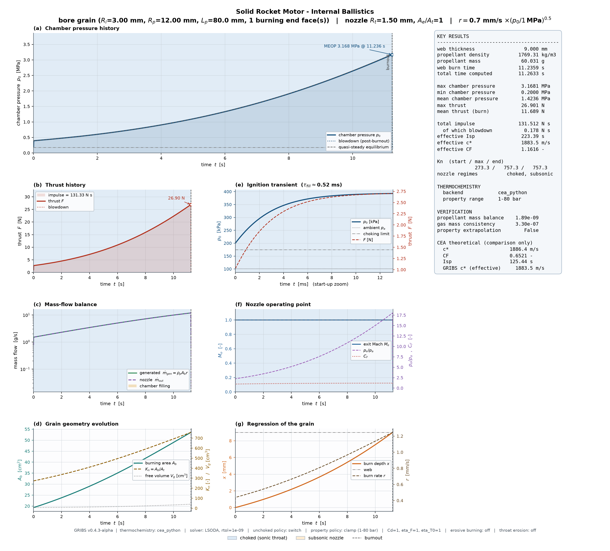

# GRIBS

GRIBS is a JSON-configured transient internal-ballistics simulator for solid rocket motors. It models cylindrical-bore grain regression, unsteady chamber pressure, choked and unchoked nozzle flow, optional flow separation, optional erosive burning, optional throat erosion, and post-burnout blowdown.

**Current release:** v0.4.3-alpha  
**Release status:** Pre-release. Results must be independently validated before engineering or experimental use.

## Highlights

- Complete user configuration through `gribs_config.json`
- Direct integration with the official NASA CEA Python package through `import cea`
- Transitional support for an external `fcea2` executable
- Explicit thermochemistry backend selection with no silent fallback
- Pressure-dependent chamber properties tabulated and interpolated with PCHIP in `ln(p)`
- Constituent-density-based propellant mixture-density calculation
- Packing-fraction correction for bulk propellant density
- Numerical self-tests before production calculations
- PNG, CSV, text, and JSON outputs
- Detailed configuration, environment, cache, and thermochemistry provenance in `summary.json`
- Optional theoretical CEA rocket-performance diagnostics for comparison only

## What changed from the v0.3 series

The v0.4 series retains the established GRIBS unsteady internal-ballistics, grain-regression, burn-rate, nozzle-flow, throat-erosion, and blowdown models. The main changes are in thermochemistry integration, configuration validation, reproducibility, diagnostics, and provenance reporting.

- Added the recommended `cea_python` backend using the official NASA CEA Python package.
- Renamed the external executable backend from `cea2` to `cea_legacy_executable`.
- Removed the manual `legacy_fit` gas-property backend.
- Made thermochemistry backend selection explicit and mandatory.
- Standardized bulk propellant density calculation from constituent mass fractions, constituent solid densities, and packing fraction.
- Added stronger thermochemistry cache identity and validation.
- Added strict JSON validation, including rejection of unknown keys.
- Added optional theoretical CEA `c*`, `Cf`, and `Isp` diagnostics for comparison only.
- Added `--backend`, `--validate-config`, `--dump-thermo`, `--no-cache`, and `--version` command-line options.
- Expanded execution and thermochemistry provenance in `summary.json`.

The update from the supplied v0.4.2-alpha implementation to v0.4.3-alpha changes version identifiers and corrects comments and user-facing documentation. It does not change the core calculation logic.

## Repository files

```text
GRIBS/
├── GRIBS_v0.4.3-alpha.py
├── gribs_config.json
├── requirements.txt
├── README.md
├── CHANGELOG.md
├── LICENSE
├── CITATION.cff
├── CONTRIBUTING.md
├── SECURITY.md
└── .gitignore
```

External CEA runtime files are not distributed by GRIBS.

## Requirements

- Python 3.11 or later is recommended
- NumPy
- SciPy
- Matplotlib
- Official NASA CEA Python package, API version 3.0 or later, for the recommended `cea_python` backend

Create and activate a virtual environment, then install the dependencies:

```bash
python3 -m venv .venv
source .venv/bin/activate
python -m pip install --upgrade pip
python -m pip install -r requirements.txt
```

Check the installed packages:

```bash
python -m pip check
python -c "import numpy, scipy, matplotlib, cea; print(cea.__version__)"
```

## Quick start

Place `GRIBS_v0.4.3-alpha.py` and `gribs_config.json` in the same directory.

Validate the configuration without initializing CEA:

```bash
python GRIBS_v0.4.3-alpha.py --config gribs_config.json --validate-config
```

Run the numerical self-tests:

```bash
python GRIBS_v0.4.3-alpha.py --config gribs_config.json --selftest
```

Run the simulation:

```bash
python GRIBS_v0.4.3-alpha.py --config gribs_config.json
```

Display the program version:

```bash
python GRIBS_v0.4.3-alpha.py --version
```

The default configuration path is resolved relative to the Python file. This allows the program to be started with the Visual Studio Code Run command even when the terminal working directory differs from the source directory.

## Configuration

All standard user inputs are stored in `gribs_config.json`. The main sections are:

- `propellant`
- `grain`
- `nozzle`
- `environment`
- `igniter`
- `thermochemistry`
- `solver`
- `output`

Field names include SI units where applicable. Edit the JSON configuration rather than the runtime `Config` dataclass in the Python source.

The current configuration schema is:

```json
{
  "schema_version": "0.4.3-alpha"
}
```

The v0.4 schema is not a drop-in replacement for a v0.3 configuration.

## Thermochemistry backend selection

The backend must be selected explicitly. GRIBS does not choose a default backend and does not silently substitute another backend if the selected backend is unavailable.

### Recommended: official NASA CEA Python package

```json
{
  "thermochemistry": {
    "backend": "cea_python"
  }
}
```

The `cea_python` backend:

- imports the official package as `cea`
- performs HP equilibrium calculations through the Python API
- does not launch an external executable
- does not require `thermo.lib` or `trans.lib` beside the GRIBS script
- records package, library, database, and cache provenance

Install the backend with:

```bash
python -m pip install "cea>=3.0"
```

Official NASA CEA project:

- https://github.com/nasa/CEA
- https://nasa.github.io/cea/

### Transitional: external CEA executable

```json
{
  "thermochemistry": {
    "backend": "cea_legacy_executable"
  }
}
```

The `cea_legacy_executable` backend retains the v0.3 external `fcea2` workflow for regression comparison during the v0.4 alpha series. It requires a compatible executable and thermodynamic database files.

When using this backend, place the following files in the same directory as the selected GRIBS Python file unless alternative paths are configured:

```text
fcea2
thermo.lib
trans.lib
```

On Linux, the executable may require permission:

```bash
chmod +x fcea2
```

NASA CEA is not developed, maintained, or distributed by the GRIBS project. Users are responsible for obtaining compatible CEA software and databases from an authorized source and complying with the applicable terms.

### Removed backend

The v0.3 `legacy_fit` backend is no longer supported. GRIBS v0.4 does not use manually fitted pressure correlations as a substitute for CEA.

## Propellant composition and bulk density

Reactant names, mass percentages, constituent solid densities, and initial temperatures are read from `propellant.reactants`.

Example:

```json
{
  "name": "NH4NO3(IV)",
  "wt_percent": 88.7,
  "temperature_K": 298.15,
  "density_kg_m3": 1720.0
}
```

Requirements:

- Reactant names must exist in the thermochemistry database used by the selected backend.
- `wt_percent` values must sum to 100.
- Every `density_kg_m3` value must be positive and represent the relevant solid constituent density.
- Every `temperature_K` value must be positive.
- `packing_fraction` must satisfy `0 < packing_fraction <= 1`.

GRIBS calculates the ideal additive-volume mixture density as:

```text
rho_ideal = 1 / sum_i(w_i / rho_i)
```

The bulk propellant density used by the internal-ballistics model is:

```text
rho_p = rho_ideal * packing_fraction
```

Equivalently:

```text
rho_p = packing_fraction / sum_i(w_i / rho_i)
```

CEA combustion-product gas density is never used as the solid propellant density.

This mixing rule is an approximation. Constituent interaction, processing, porosity, phase changes, and non-additive volume effects may require measured bulk-density data or a more specialized model.

## Inputs not determined by CEA

CEA equilibrium calculations do not determine all solid-propellant motor inputs. Users must provide defensible values for quantities including:

- burn-rate coefficient
- pressure exponent
- burn-rate temperature sensitivity
- erosive-burning coefficients
- constituent solid densities
- packing fraction
- grain geometry
- nozzle discharge coefficient
- thrust efficiency
- throat-erosion parameters

These inputs should be based on appropriate material data, experiments, calibration, or validated references.

## CEA theoretical rocket diagnostics

When enabled for `cea_python`, GRIBS can report theoretical CEA rocket-performance values, including theoretical `c*`, `Cf`, and `Isp`.

These values are for comparison only. They are not fed back into the GRIBS unsteady internal-ballistics or nozzle-flow calculations. They must not be confused with the GRIBS effective quantities `cstar_eff_m_s`, `CF_eff`, and `Isp_s`.

## Command-line options

```text
--config FILE          Select a complete JSON configuration file
--backend NAME         Override the configured thermochemistry backend for one run
--selftest             Run numerical self-tests only
--validate-config      Validate the JSON configuration and exit
--dump-thermo FILE     Write the chamber-property table and exit
--no-cache             Force rebuilding of the chamber-property table
--version              Display the GRIBS version
```

Example thermochemistry-table export:

```bash
python GRIBS_v0.4.3-alpha.py \
  --config gribs_config.json \
  --dump-thermo thermo_table.json
```

## Outputs

The default output directory is `results/`. Output names are configurable in `gribs_config.json`.

```text
results/
├── ballistics.png
├── time_history.csv
├── summary.txt
├── summary.json
└── thermo_cache/
```

- `ballistics.png`: combined publication-style result figure
- `time_history.csv`: sampled time history
- `summary.txt`: human-readable result summary
- `summary.json`: configuration, resolved runtime inputs, derived values, environment information, thermochemistry provenance, diagnostics, and results
- `thermo_cache/`: reusable pressure-dependent chamber-property tables

### Example output

The following figure is an example of the combined diagnostic output generated
by GRIBS. It shows the chamber-pressure and thrust histories, mass-flow balance,
grain-geometry evolution, ignition transient, nozzle operating point, grain
regression, and a summary of the principal calculated results.



*Example combined diagnostic figure generated by GRIBS v0.4.3-alpha. Click the
image to view the full-resolution version. The displayed values are from an
example calculation and are not validated design recommendations.*

## Validation status

For v0.4.3-alpha:

- Python syntax compilation was checked.
- JSON syntax validation was checked.
- `--version` reports `GRIBS 0.4.3-alpha`.
- `--validate-config` accepts the supplied v0.4.3-alpha configuration.
- The full program runs numerical self-tests before each production calculation.
- Full numerical behavior must be validated in the user's target environment with the selected CEA backend and installed dependency versions.

## Known limitations

- This is alpha-stage research software and is not certified for safety-critical use.
- Chemical equilibrium does not model finite-rate chemistry.
- The additive-volume density rule is an approximation.
- Burn-rate and erosive-burning coefficients are empirical inputs.
- The external executable backend depends on the user's compatible executable and database files.
- Theoretical CEA rocket diagnostics do not replace GRIBS results.
- Model outputs are not substitutes for static firing tests, material characterization, or independent review.

## License

GRIBS is licensed under the MIT License.

Copyright (c) 2026 Hikaru Kurokawa.

The GRIBS license applies only to files distributed by the GRIBS project. External NASA CEA software and databases are not included in this repository and remain subject to their respective terms.

## Citation

Citation metadata is provided in `CITATION.cff`.

## Contributing and support

See `CONTRIBUTING.md` for contribution guidance. Use GitHub Issues for reproducible bug reports and feature proposals. See `SECURITY.md` for private security-reporting guidance.
