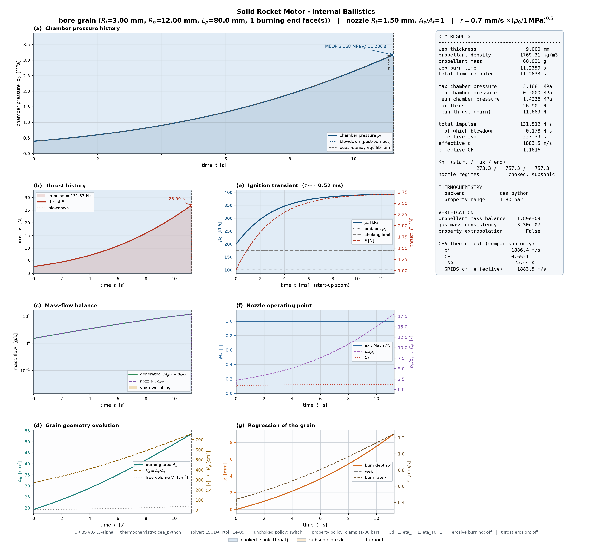

# GRIBS

GRIBS is a JSON-configured transient internal-ballistics simulator for solid rocket motors. It models cylindrical-bore grain regression, unsteady chamber pressure, choked and unchoked nozzle flow, optional flow separation, optional erosive burning, optional throat erosion, and post-burnout blowdown.

**Current release:** v0.7.0-alpha — package split and Python interface; opt-in energy mode (experimental)  
**Release status:** Alpha research software. Physical validity has not been established; the comparison with the CEA reference `c*` (gate G4a) has not passed, and reported-data / experimental reproduction (G4b) and the release gate (G5) are not complete. Results must not be used for production, safety-critical, or design decisions without independent validation. See [Validation status](#validation-status) and [Known limitations](#known-limitations).

## Highlights

- Complete user configuration through `gribs_config.json`
- Direct integration with the official NASA CEA Python package through `import cea`
- Transitional support for an external `fcea2` executable
- Explicit thermochemistry backend selection with no silent fallback
- Pressure-dependent chamber properties tabulated and interpolated with PCHIP in `ln(p)`
- Constituent-density-based propellant mixture-density calculation
- Packing-fraction correction for bulk propellant density
- Homogeneous-equilibrium two-phase chamber model on a total-product mass basis (condensed products carried with the gas)
- Numerical self-tests on request (`--selftest`)
- Atomic writes of the chamber-property cache, with a structured error on write failure
- PNG, CSV, text, and JSON outputs
- Detailed configuration, environment, cache, and thermochemistry provenance in `summary.json`
- Optional theoretical CEA rocket-performance diagnostics for comparison only

## What changed in v0.7.0-alpha

v0.7.0-alpha is the first release after v0.6.2-alpha. The program version is 0.7.0-alpha and the program file is `GRIBS_v0.7.0-alpha.py` (renamed from `GRIBS_v0.6.2-alpha.py`; the old name is not kept, so scripts that call it must be updated). The configuration schema is unchanged at `0.5.0-alpha`. The program code has been moved from the single file into the Python package `gribs` under `src/gribs/`; the program file remains the command line and imports the package from the `src/` directory next to it. The split itself did not change command-line options, exit codes, outputs or numerical results; the items of P5, A-9 and the energy mode change some outputs where `CHANGELOG.md` says so (see "Breaking" there). A Python interface (`gribs.run_simulation`, `gribs.Result`, `gribs.__version__`) is added; see [Python API](#python-api) and [Repository files](#repository-files). The G0 decision for the release commit is stated in the release notes; see [Validation status](#validation-status).

**Energy mode (experimental, opt-in).** A configuration with an `energy_model` section is run with a chamber energy balance. Without that section nothing changes. "Experimental" means: the mode is opt-in; its keys, outputs and behaviour may change in a later release without notice; it is verified on synthetic fixtures only; the number of cases qualified with a real propellant is 0; and its effect on results for a real propellant has not been evaluated. See [Energy mode](#energy-mode-opt-in-synthetic-fixtures-only) and `MODEL_LIMITATIONS.md`.

## What changed in v0.6.2-alpha

v0.6.2-alpha is a patch release of v0.6.0-alpha "Keystone". The program version is 0.6.2-alpha and the program file is `GRIBS_v0.6.2-alpha.py`; the configuration schema is unchanged at `0.5.0-alpha`. Numerical results are unchanged. See `CHANGELOG.md` for the full list.

- **High-condensate warning.** Runs whose thermochemistry table reaches `Yg_min <= 0.80` with model status `approximate_with_limitations` also report `W_HIGH_CONDENSATE_G4B_UNVALIDATED`: reproduction of reported or experimental data (G4b) has not been done for that band. `model_status`, the run verdict and the exit codes are unchanged (see [Known limitations](#known-limitations)).
- **Validation status.** G0 is described as approved for the v0.6.1-alpha release commit `cf91f97` (as well as `4e7896a`).

## What changed in v0.6.1-alpha

v0.6.1-alpha is a patch release of v0.6.0-alpha. The program version is 0.6.1-alpha and the program file is `GRIBS_v0.6.1-alpha.py`; the configuration schema is unchanged at `0.5.0-alpha`. The simulation code is unchanged apart from the version identifiers and one source comment. See `CHANGELOG.md` for the full list.

- **Default configuration.** `gribs_config.json` uses graphite `C(gr)` instead of `C`, which in the NASA CEA database is gaseous atomic carbon. Results of the default configuration change accordingly (see [Propellant composition and bulk density](#propellant-composition-and-bulk-density)).
- **Golden cases.** g7 and g8 are g3 and g6 with `C(gr)`. The values of g1–g6 are unchanged; g3 and g6 keep `C` as numerical regression references.
- **Documentation.** The outside-range setting is named by its JSON key `thermochemistry.outside_range_policy`; GRIBS does not check whether a composition is plausible.

## What changed in v0.6.0-alpha

v0.6.0-alpha is the first public release after v0.4.3-alpha. The intermediate v0.5.0-alpha was an internal Phase A baseline and was not published. The program version is 0.6.0-alpha; the configuration schema is unchanged at `0.5.0-alpha`. See `CHANGELOG.md` for the full list.

- **Two-phase model B and corrected mass basis.** The conserved chamber mass is the total product mass (gas + condensed). The equation of state acts on the gas phase only, and the CEA molecular weight is used as total mass per kmol of gas, without a second gas-fraction factor. Thermochemistry cache columns and cache identity were renamed accordingly; caches written under the old mass basis are not silently reused.
- **Validation and status reporting.** `validation.model_status` no longer reports `validated_in_scope`; statuses state what they are based on. Model-applicability checks fail closed on missing or non-finite phase fractions.
- **Input robustness.** NaN and infinite numbers are rejected in configuration files and in `Config` values (including NumPy and `Decimal` values), before any calculation.
- **Diagnostics.** A failed CEA theoretical diagnostic no longer stops the run or the summary; its status is reported.
- **Chamber-property cache.** The cache is written atomically; a write failure stops the run with exit code 3 (`E_THERMO_CACHE_WRITE_FAILED`). See [Chamber-property cache writes and concurrent runs](#chamber-property-cache-writes-and-concurrent-runs) for the operating assumptions and what is not tested.
- **Verification assets.** Golden regression cases (`cases/golden/`), reference problems, a mass and energy ledger, a convergence harness, and the A-5.1 mass-basis evidence (`verification/`).
- **CLI.** Self-tests run only with `--selftest`; normal runs no longer run them first. The `--backend` override is validated in two stages (see below).

Not included in this release (see [Known limitations](#known-limitations)): stopping at the property-table range with a dedicated exit code (M3), the safe output mode, the Phase B physical extensions (B1), and the Phase B comparison layers (B2-C / B2-D).

## What changed from the v0.3 series (v0.4 series)

The v0.4 series retains the established GRIBS unsteady internal-ballistics, grain-regression, burn-rate, nozzle-flow, throat-erosion, and blowdown models. The main changes are in thermochemistry integration, configuration validation, reproducibility, diagnostics, and provenance reporting.

- Added the recommended `cea_python` backend using the official NASA CEA Python package.
- Renamed the external executable backend from `cea2` to `cea_legacy_executable`.
- Removed the manual `legacy_fit` gas-property backend.
- Made thermochemistry backend selection explicit and mandatory.
- Standardized bulk propellant density calculation from constituent mass fractions, constituent solid densities, and packing fraction.
- Added stronger thermochemistry cache identity and validation.
- Added strict JSON validation, including rejection of unknown keys.
- Added optional theoretical CEA `c*`, `Cf`, and `Isp` diagnostics for comparison only.
- Added `--backend`, `--validate-config`, `--dump-thermo`, `--no-cache`, and `--version` command-line options.
- Expanded execution and thermochemistry provenance in `summary.json`.

The update from the supplied v0.4.2-alpha implementation to v0.4.3-alpha changes version identifiers and corrects comments and user-facing documentation. It does not change the core calculation logic.

## Repository files

```text
GRIBS/
├── GRIBS_v0.7.0-alpha.py   program file and command line (imports the package below)
├── src/gribs/             the GRIBS package (the program code)
├── pyproject.toml         package metadata (version, see Python API)
├── gribs_config.json
├── requirements.txt
├── requirements-dev.txt
├── README.md
├── CHANGELOG.md
├── MODEL_LIMITATIONS.md
├── LICENSE
├── CITATION.cff
├── CONTRIBUTING.md
├── SECURITY.md
├── cases/            golden and reference input cases
├── examples/         example configuration
├── tests/            pytest suite
├── tools/            verification tools
├── verification/     recorded verification evidence
├── docs/G0/          G0 approval records (see Validation status)
└── results_golden_g1 … g6/   recorded golden outputs (regression references)
```

The repository root also keeps the patch files (`*.diff`) of earlier Phase A steps as historical records.

External CEA runtime files are not distributed by GRIBS.

## Requirements

- Python 3.11 or later. The GitHub CI runs the test suite on Python 3.11, 3.12 and 3.13. Python 3.14 is checked locally only (it is the environment of the recorded G0 evidence; see [Validation status](#validation-status)); it is not part of the CI matrix.
- NumPy
- SciPy
- Matplotlib
- Official NASA CEA Python package, API version 3.0 or later, for the recommended `cea_python` backend

Create and activate a virtual environment, then install the dependencies:

```bash
python3 -m venv .venv
source .venv/bin/activate
python -m pip install --upgrade pip
python -m pip install -r requirements.txt
```

Check the installed packages:

```bash
python -m pip check
python -c "import numpy, scipy, matplotlib, cea; print(cea.__version__)"
```

## Quick start

Run from a copy of the repository: `GRIBS_v0.7.0-alpha.py` needs the directory `src/gribs/` next to it (it adds `src/` to the Python import path), so copying the program file alone is not enough. Place `gribs_config.json` in the same directory, or select another file with `--config`.

Validate the configuration without initializing CEA:

```bash
python GRIBS_v0.7.0-alpha.py --config gribs_config.json --validate-config
```

For an `energy_model` configuration, `--validate-config` checks the configuration file only (its keys and values and the rules applied when it is loaded). The energy-mode checks made when the run starts, including the presence of `propellant_formulas`, the explicit `reference_constant` values, the construction of the thermochemistry backend and the element check and the latent-heat check at t = 0, are not made, so a valid result does not guarantee that the run starts.

Run the numerical self-tests:

```bash
python GRIBS_v0.7.0-alpha.py --config gribs_config.json --selftest
```

Run the simulation:

```bash
python GRIBS_v0.7.0-alpha.py --config gribs_config.json
```

Display the program version:

```bash
python GRIBS_v0.7.0-alpha.py --version
```

The default configuration path is resolved relative to the Python file. This allows the program to be started with the Visual Studio Code Run command even when the terminal working directory differs from the source directory.

## Configuration

All standard user inputs are stored in `gribs_config.json`. The main sections are:

- `propellant`
- `grain`
- `nozzle`
- `environment`
- `igniter`
- `thermochemistry`
- `solver`
- `output`
- `two_phase_model`

Field names include SI units where applicable. Edit the JSON configuration rather than the runtime `Config` dataclass in the Python source.

`thermochemistry.outside_range_policy` (required) selects how chamber properties are treated outside the tabulated pressure range `thermochemistry.pressure_range`: `"clamp"` holds them at the nearest table limit, and `"extrapolate"` extrapolates the table. The supplied configurations use `"clamp"`. In the Python source this setting is the `Config` field `property_policy`; that name is not a JSON key, and a configuration that contains it is rejected as an unknown key.

The current configuration schema is:

```json
{
  "schema_version": "0.5.0-alpha"
}
```

The configuration schema did not change in v0.6.0-alpha, v0.6.1-alpha, v0.6.2-alpha or v0.7.0-alpha: it is still `0.5.0-alpha`, so v0.5.0-alpha configurations are used as they are. Configurations with schema `0.4.4-alpha`, `0.4.3-alpha` or `0.3.0-alpha` are migrated automatically when loaded where possible, and the migration notes are recorded in `summary.json`; a configuration that selects a removed backend is rejected. Other schema values are rejected.

## Thermochemistry backend selection

The backend must be selected explicitly. GRIBS does not choose a default backend and does not silently substitute another backend if the selected backend is unavailable.

### Recommended: official NASA CEA Python package

```json
{
  "thermochemistry": {
    "backend": "cea_python"
  }
}
```

The `cea_python` backend:

- imports the official package as `cea`
- performs HP equilibrium calculations through the Python API
- does not launch an external executable
- does not require `thermo.lib` or `trans.lib` beside the GRIBS script
- always uses the `thermo.lib` of the official package (and its `trans.lib`, only when `transport` is true). A plain `import cea` would load a `thermo.lib` / `trans.lib` found in the working directory or in `CEA_DATA_DIR` instead; GRIBS imports `cea` without that automatic loading (`CEA_SKIP_INIT`) and loads the package files explicitly. Files found in those places are not read; the run reports them with the warning `W_EXTERNAL_CEA_DATABASE_IGNORED`. Selecting another database is not supported.
- stops with `E_CEA_DATABASE_ALREADY_INITIALIZED` (exit code 3 on the command line) when `cea` was already loaded with another database in the same process, for example after `import cea` in a directory that contains a `thermo.lib`. cea cannot load a second database in a process; run GRIBS in a new process.
- records package, library, database, and cache provenance: `summary.json` → `thermochemistry.database_identity` holds the full SHA-256 and the path of the `thermo.lib` used (and of `trans.lib` when it is used) and the ignored files

Install the backend with:

```bash
python -m pip install "cea>=3.0"
```

Official NASA CEA project:

- https://github.com/nasa/CEA
- https://nasa.github.io/cea/

### Transitional: external CEA executable

```json
{
  "thermochemistry": {
    "backend": "cea_legacy_executable"
  }
}
```

The `cea_legacy_executable` backend retains the v0.3 external `fcea2` workflow for regression comparison during the alpha series. It requires a compatible executable and thermodynamic database files.

When using this backend, place the following files in the same directory as the selected GRIBS Python file unless alternative paths are configured:

```text
fcea2
thermo.lib
trans.lib
```

On Linux, the executable may require permission:

```bash
chmod +x fcea2
```

NASA CEA is not developed, maintained, or distributed by the GRIBS project. Users are responsible for obtaining compatible CEA software and databases from an authorized source and complying with the applicable terms.

### Removed backend

The v0.3 `legacy_fit` backend is no longer supported. GRIBS does not use manually fitted pressure correlations as a substitute for CEA.

## Propellant composition and bulk density

Reactant names, mass percentages, constituent solid densities, and initial temperatures are read from `propellant.reactants`.

Example:

```json
{
  "name": "NH4NO3(IV)",
  "wt_percent": 88.7,
  "temperature_K": 298.15,
  "density_kg_m3": 1720.0
}
```

Requirements:

- Reactant names must exist in the thermochemistry database used by the selected backend. Use the name of the intended phase: in the NASA CEA database `C` is gaseous atomic carbon (about +59.67 MJ/kg at 298.15 K) and graphite is `C(gr)`; likewise `AL` is aluminium vapour and `AL(cr)` is solid aluminium. GRIBS does not check whether the chosen species are plausible propellant ingredients.
- `wt_percent` values must sum to 100.
- Every `density_kg_m3` value must be positive and represent the relevant solid constituent density.
- Every `temperature_K` value must be positive.
- `packing_fraction` must satisfy `0 < packing_fraction <= 1`.

GRIBS calculates the ideal additive-volume mixture density as:

```text
rho_ideal = 1 / sum_i(w_i / rho_i)
```

The bulk propellant density used by the internal-ballistics model is:

```text
rho_p = rho_ideal * packing_fraction
```

Equivalently:

```text
rho_p = packing_fraction / sum_i(w_i / rho_i)
```

CEA combustion-product gas density is never used as the solid propellant density.

This mixing rule is an approximation. Constituent interaction, processing, porosity, phase changes, and non-additive volume effects may require measured bulk-density data or a more specialized model.

## Inputs not determined by CEA

CEA equilibrium calculations do not determine all solid-propellant motor inputs. Users must provide defensible values for quantities including:

- burn-rate coefficient
- pressure exponent
- burn-rate temperature sensitivity
- erosive-burning coefficients
- constituent solid densities
- packing fraction
- grain geometry
- nozzle discharge coefficient
- thrust efficiency
- throat-erosion parameters

These inputs should be based on appropriate material data, experiments, calibration, or validated references.

## CEA theoretical rocket diagnostics

When enabled for `cea_python`, GRIBS can report theoretical CEA rocket-performance values, including theoretical `c*`, `Cf`, and `Isp`.

These values are for comparison only. They are not fed back into the GRIBS unsteady internal-ballistics or nozzle-flow calculations. They must not be confused with the GRIBS effective quantities `cstar_eff_m_s`, `CF_eff`, and `Isp_s`.

## Command-line options

```text
--config FILE          Select a complete JSON configuration file
--backend NAME         Override the configured thermochemistry backend for one run
--selftest             Run numerical self-tests only
--validate-config      Validate the JSON configuration and exit
--dump-thermo FILE     Write the chamber-property table and exit
--no-cache             Force rebuilding of the chamber-property table
--allow-verification-failure
                       Return 0 only for a mass-ledger-only verification failure
--version              Display the GRIBS version
```

### Process exit codes

| Code | Meaning |
|---:|---|
| 0 | Run passed, or a mass-ledger-only failure was explicitly allowed. The diagnostic outputs still record the failed ledger. |
| 1 | Run verification gate or standalone self-test failed; also used for model-applicability rejection. |
| 2 | Configuration is invalid. |
| 3 | Thermochemistry backend initialization failed, including a failure to write the chamber-property cache (`E_THERMO_CACHE_WRITE_FAILED`). |
| 4 | Simulation/integration failed, including an integration that exceeds a safety limit (`E_INTEGRATION_BUDGET_EXCEEDED`: more than 2,000,000 right-hand-side evaluations, more than 300 s of wall time, or more than 10,000 solver restarts at the property-table limits). |
| 5 | Mass-ledger verification failed while the other run-verification gates passed. |

Energy mode uses the codes above as follows; no code has a new meaning, and code 5 is not used.

| Code | Energy mode |
|---:|---|
| 0 | the run completed, `gamma_s > 1` held and the closure residuals are within the threshold (an exit-code decision, not a statement that the results are physically valid) |
| 1 | a normalised closure residual exceeds the threshold (`W_ENERGY_CLOSURE_FAILED`; the files are written first). This is the energy closure gate, not the mass-ledger gate of code 5 |
| 2 | invalid configuration, including the rejected items above (except a non-unique reactant basis, which stops the run with code 4); also `--selftest`, `--dump-thermo`, `--no-cache` or `--allow-verification-failure` with an `energy_model` section |
| 3 | the thermochemistry backend could not be initialised (for example the `cea` package is missing for `cea_python`), or the TP cache could not be written (`E_THERMO_CACHE_WRITE_FAILED`, as the legacy chamber-property cache) |
| 4 | the simulation failed (a failed state recovery, `gamma_s` not above 1, a non-unique reactant basis, an integration failure, including an integration that exceeds a safety limit such as 300 s of wall time over the whole run); an unexpected exception (`E_ENERGY_UNEXPECTED_ERROR`, with its traceback on stderr); a failure to write the output files (`E_ENERGY_OUTPUT_WRITE_FAILED`) |

`--allow-verification-failure` is rejected with an `energy_model` section (code 2): it applies only to the legacy mass-ledger gate (code 5), and the energy closure failure (code 1) is never downgraded; `--no-cache` is rejected for the same reason (it concerns the legacy chamber-property cache).

`--allow-verification-failure` applies only when the mass ledger is the sole
failed run-verification gate. It does not override post-run consistency or
model-applicability failures. In a failed normal run, the CSV, text summary,
and JSON summary are written before the nonzero exit; the ledger warning and
residuals remain recorded even when the flag permits exit code 0.

### Backend override (`--backend`)

`--backend NAME` is validated in two stages:

1. The file is read on its own, with the same rules as without the override. The file must
   name a valid backend and satisfy that backend's section rules.
2. The combination with `NAME` is read. For example, `cea_legacy_executable` cannot run
   `two_phase_model.mode = "homogeneous_equilibrium"`, and `NAME`'s own section must be
   present.

Value checks such as `R_i0 < R_p` and `p_a >= p_fit_min` run once afterwards, on the
effective configuration.

Both `--validate-config` and a normal run report an invalid configuration as a
configuration error (exit code 2). Validation stops at the first error:

- An error found while reading the file on its own (stage 1) is reported first, with the
  same message as without the override.
- If the file's only problem is a value check and the combination is also invalid, the
  combination error may be reported first.
- After one problem is fixed, another may be reported.

The cache settings are taken from the section of the backend that runs.

When the override is `reference_constant`:

- If the file has no `reference_constant` section, the documented defaults are used
  (3000 K, 1.2, 25 kg/kmol). This is the Phase A-5 contract.
- If the file is written for another backend and has a partial `reference_constant`
  section, the missing values take the same defaults. This keeps the earlier behaviour.

See `verification/cli/CLI_BACKEND_OVERRIDE_ADR.md`.

Example thermochemistry-table export:

```bash
python GRIBS_v0.7.0-alpha.py \
  --config gribs_config.json \
  --dump-thermo thermo_table.json
```

## Python API

Added in v0.7.0-alpha. The package `gribs` (`src/gribs/`) has three public names:

- `gribs.run_simulation(config_path, *, backend_override=None)` runs one configuration file and returns a `gribs.Result`. `backend_override` has the meaning of `--backend`. It calls the same functions in the same order as the command line.
- `gribs.Result` is a frozen dataclass with the `summary.json` sections `program`, `configuration_source`, `configuration_migration`, `original_configuration`, `resolved_configuration`, `derived_inputs`, `two_phase_model`, `thermochemistry` and `summary` (the `results` section), plus `history` (the arrays `time_history.csv` is written from), `integration_budget` and `run_passed` (the verdict for which the command line exits with a nonzero code when it is false). The properties `warnings` and `program_version` read `summary["warnings"]` and `program["version"]`.
- `gribs.__version__` is the program version (`0.7.0-alpha`). The version `0.7.0a0` in `pyproject.toml` is the PEP 440 form of the release version; it is not reported anywhere.

```python
import gribs   # with src/ on the import path, for example: PYTHONPATH=src python example.py

result = gribs.run_simulation("gribs_config.json")
print(result.run_passed, result.summary["p_max_Pa"], result.summary["Isp_s"])
```

Limits of this interface:

- The input is the path of a configuration file; a configuration given as a Python dictionary is not accepted.
- Runs in one process must be made one after another. Concurrent runs (for example in threads) are not supported: the selected thermochemistry backend is module state of `gribs.thermo`; `run_simulation` restores it after each call, also after an error.
- Nothing is printed and no output file is written (no `summary.json`, `time_history.csv` or figure). The chamber-property cache is still read and written, in the same directory as by the command line (in energy mode the TP cache is used instead: see "Energy mode").
- Errors are raised instead of being turned into exit codes: `gribs.errors.ConfigurationError` (command line: exit code 2), `gribs.errors.ThermochemistryError` (3), `gribs.api.ModelApplicabilityError` (1, raised before the simulation) and the errors of the simulation (4).
- A `Result` does not contain the `summary.json` sections `environment`, `cea_theoretical_diagnostics` and `output_files`, which only the command line computes. There is no input hash, no uncertainty summary and no dedicated warning type (warnings are dictionaries as in `summary.json`).

## Energy mode (opt-in; synthetic fixtures only)

Energy mode is selected only by an `energy_model` section in the configuration file. Without it the program runs the model described above, with the same outputs and exit codes. **Energy mode is verified on synthetic fixtures only: the number of cases qualified with a real propellant is 0, and its results are not compared with measured data or, for a condensed volume, with the legacy model.** The mode is experimental: it is opt-in, its keys, outputs and behaviour may change in a later release without notice, and its effect on results for a real propellant has not been evaluated. The schema version is unchanged; the section is optional.

Required keys (there are no defaults):

| Key under `energy_model` | Meaning |
|---|---|
| `initial_fill.temperature_K`, `.composition`, `.element_tolerance` | temperature of the initial charge; `main_propellant_products` is the only composition; tolerance of the element check at t = 0 |
| `wall.adiabatic`, `wall.heat_rate_W` | `adiabatic` is declared explicitly; `heat_rate_W` is required unless the wall is adiabatic, and is rejected when it is given together with an adiabatic wall |
| `burn_surface.form`, `.grain_far_temperature_K`, `.solid_enthalpy` (`reference_J_kg`, `reference_temperature_K`, `cp_J_kgK`) | form `a` only; the temperature at which `h_s` is evaluated; the enthalpy of the solid on the absolute basis of the products (formation enthalpy included) |
| `condensed.volume`, `.phases`, `.transitions` | `external_density` only; constant density, heat capacity and enthalpy of each condensed species; melting temperatures |
| `recovery.phase_fraction_tolerance`, `.root_tolerance`, `.plateau_edge_tolerance`, `.temperature_search_K`, `.start_temperatures_K` | tolerances of the state recovery; the searched temperature range `[T_lo, T_hi]` and the start temperatures inside it |
| `propellant_formulas` | formula of each reactant, `{element symbol: atoms}` (case-sensitive: `Cl`, `Co`); required to run; never inferred from species names |

There is no key for the density of the solid propellant: `Config.rho_p` (the bulk density computed from the reactants and the packing fraction) is the only one. The isentropic exponent of the nozzle flow is the equilibrium `gamma_s` of the CEA TP solution (the configured `reference_gamma` for `reference_constant`); a state with `gamma_s` not finite or not above 1 stops the run.

Rejected in energy mode (the same list as item 9 of "Energy mode" in `MODEL_LIMITATIONS.md`):

- an igniter (`E_ENERGY_MODE_IGNITER_REJECTED`);
- `equilibrium_pressure_diagnostic` other than `off` (for example `sampled`);
- `temperature_efficiency` (`eta_T0`) other than 1;
- `two_phase_model.mode` other than `homogeneous_equilibrium`;
- an initial fill other than the products of the main propellant (an air fill), and an initial state given by the pressure only (the fill temperature is required);
- a non-adiabatic wall without `heat_rate_W`, and `heat_rate_W` together with an adiabatic wall;
- `burn_surface.form` other than `a`, and `condensed.volume` other than `external_density`;
- unknown keys; `propellant_formulas` missing, or an element symbol that is not in the atomic-mass table (symbols are case-sensitive);
- a reactant basis whose weights are not unique or not non-negative (found when the run starts; exit code 4);
- a thermochemistry backend other than `cea_python` and `reference_constant`;
- the backend `reference_constant` when `temperature_K`, `gamma` or `molecular_weight_kg_kmol` is not stated in `thermochemistry.reference_constant` of the file (in energy mode these three values have no defaults; for example `--backend reference_constant` on a file written for `cea_python` is rejected);
- `--selftest`, `--dump-thermo`, `--no-cache` or `--allow-verification-failure` together with an `energy_model` section (energy mode does not build the legacy thermochemistry table or use the legacy chamber-property cache, and has no mass-ledger gate for the last flag to relax).

Outputs of an energy run, in the output directory:

- `energy_time_history.csv`: columns with units, including the four closure residuals (mass, element inventory, energy, volume; absolute and normalised);
- `summary.txt` and `summary.json` (under their configured names): `summary.json` has the top-level keys `model_mode = "energy"` and `energy_model` (`scope`, `contract`, `burn_surface_form`, `burn_surface_interpretation`, `H0_out_definition`, `held_items_adopted`, `gamma_s` (definition and range), `provenance` (including `enthalpy_convention`), `settings`, `latent_heat_check`, `closure_tolerance_normalised`, `closure_tolerance_status`, `legacy_outputs_not_produced` and `legacy_comparison`); `derived_inputs.propellant_density_source`; and `output_files.legacy_history_csv` is `null`. Energy mode uses the TP cache (`thermo_cea_tp_*.json`, schema 3; earlier schemas are not read) and not the legacy chamber-property cache; `--no-cache` concerns the legacy cache only.

The legacy figure, the legacy `time_history.csv`, the CEA theoretical rocket diagnostics, the equilibrium pressure diagnostic, the legacy post-run self-test, the legacy mass and energy ledger and the legacy model-applicability check are **not produced** in energy mode; the command line prints a line saying so and the summary lists them. A run ends with exit code 0 when it completes, `gamma_s > 1` in every state and the normalised closure residuals are within a threshold of `1e-6`; that is an exit-code rule, not a statement that the results are physically valid. The threshold is provisional (held item H-09), a pass/fail threshold and not a claim of accuracy.

The analytic backend `reference_constant`, used in energy mode, has no enthalpy; energy mode gives it the convention `h(T_ref) = h_s(T_grain,inf)`. That convention is for tests only and is not a property of any propellant. The values of `reference_constant` (`temperature_K`, `gamma`, `molecular_weight_kg_kmol`) must be stated in the file; energy mode does not accept the defaults that the legacy loader supplies for `--backend reference_constant`.

The effect of the simplifications of energy mode (quasi-steady burn surface, the contents taken as at rest, so the kinetic energy of the contents and the non-uniformity of the state are not modelled (a departure from the model definition, held item H-05), adiabatic nozzle, constant condensed-phase properties, linear phase fraction on a plateau, an atomic-mass table not audited against CEA) on results has not been evaluated; see `MODEL_LIMITATIONS.md`.

## Outputs

The default output directory is `results/`. Output names are configurable in `gribs_config.json`.

```text
results/
├── ballistics.png
├── time_history.csv
├── summary.txt
├── summary.json
└── thermo_cache/
```

- `ballistics.png`: combined publication-style result figure
- `time_history.csv`: sampled time history
- `summary.txt`: human-readable result summary
- `summary.json`: configuration, resolved runtime inputs, derived values, environment information, thermochemistry provenance, diagnostics, and results
- `thermo_cache/`: reusable pressure-dependent chamber-property tables

### Run-state keys

The summary (`results` in `summary.json`, `Result.summary`) of a completed run has six run-state keys at its top level (legacy model; an energy-mode run does not produce these six keys, and its closure residuals are in `results.closure`). `summary.txt` prints them in its `[ run state ]` section and lists every warning code of the run in its `[ warning codes ]` section. A run that stops with an error has no summary and no keys. The keys do not change `run_passed` or the exit code.

| Key | Meaning |
|---|---|
| `solver_completed` | Both phases were integrated and the chamber pressure stayed finite. |
| `mass_consistency_passed` | The post-run mass consistency check and the mass ledger both passed. |
| `nominal_termination_reached` | The burn ended at burnout, and the blowdown ended at ambient pressure (or there was no blowdown). |
| `model_domain_passed` | The throat area never exceeded the exit area (`event_times.throat_exceeds_exit_s` is empty) and there is no `E_OUT_OF_VALIDATED_RANGE`. Leaving the property-table range is a warning only. |
| `warnings_present` | `warnings` is not empty. |
| `results_usable` | The first four keys are all true. |

### Effective c* and Isp definitions

`t_bo` is the end of the burning phase, `t_end` the end of the run (after the blowdown, if any), `m_out(t)` the product mass discharged through the nozzle up to `t`, `m_prop` the initial propellant mass, `I(t_end)` the total impulse and `g0 = 9.80665 m/s²`. The integrals are trapezoidal over the time-history samples.

| Key | Definition |
|---|---|
| `cstar_burn_interval_m_s` | ∫ p0·At dt over the burning phase ÷ `m_out(t_bo)` (burning phase over burning phase). |
| `cstar_eff_m_s` | ∫ p0·At dt over the burning phase ÷ `m_out(t_end)` (mixed definition, unchanged; `legacy_mixed_interval_cstar_m_s` has the same value). |
| `cstar_full_interval_m_s` | ∫ p0·At dt over the whole run ÷ `m_out(t_end)`. |
| `Isp_s` | `I(t_end)` ÷ (`m_prop`·g0): total impulse per initial propellant mass. |
| `Isp_discharged_mass_s` | `I(t_end)` ÷ (`m_out(t_end)`·g0): total impulse per discharged product mass (gas and condensed; the `m_out` column of the time history). |

Without a blowdown, `cstar_burn_interval_m_s` equals `cstar_eff_m_s`. With a blowdown, `cstar_burn_interval_m_s` is larger, because the mass discharged during the blowdown is not in its denominator (golden g3–g8: about +0.31 % to +0.40 %).

### Chamber-property cache writes and concurrent runs

With caching enabled, a run writes the cache only when it builds the table: when no cache
exists yet, or when it rebuilds the table (`rebuild_cache = true` or `--no-cache`). An
existing cache is replaced only in the second case; otherwise it is read and left
unchanged. GRIBS writes the table to a temporary file in the cache directory
(`.<name>.<pid>.<random>.tmp`), syncs it, publishes it under the cache name and syncs the
cache directory. Under the operating assumptions below, a run that reads the cache sees
either the previous complete file or the new complete file, never a partially written one.
Reading is not changed by this: a run checks that the cache name is a regular file and then
opens it normally (following symbolic links), without the special-file protection that the
writer has.

- A failure while writing the cache stops the run with exit code 3 and the structured
  error `E_THERMO_CACHE_WRITE_FAILED`. Its `context` gives `phase`, `step`, `replaced`
  (whether this run changed the cache name) and `temp_cleanup` (what happened to this
  run's temporary file). There is no fallback to an in-place write.
- If syncing the cache directory is not supported (`ENOTSUP` / `EOPNOTSUPP`), the run
  continues and records the warning `W_THERMO_CACHE_DURABILITY_NOT_GUARANTEED`.
- Survival of the cache after a crash or power loss is not guaranteed. In particular, when
  GRIBS creates a new cache directory, the parent of that directory is not synced, so the
  new directory and its cache may not survive a power loss.

Operating assumptions:

1. Restrict access to the cache directory: only trusted users of this cache may write to
   it. Temporary files are visible in the directory while a table is written; restrict
   read and search access to the directory if their content must not be readable by
   others.
2. Use the same permission settings (umask, default ACL of the directory) for all runs
   that write to the same cache directory. A setgid directory aligns the group only, not
   the mode.
3. Runs that write the same cache (same key) must produce the same content from the same
   inputs.

Concurrent runs under these assumptions (verified for one user on ext4, with threads in
one process and with 2 to 4 synchronised processes):

- If every run observed that the cache did not exist, the first run to publish keeps its
  file (inode and permissions). A later run with identical content adopts that file,
  removes its own temporary file and syncs the directory itself. New caches are published
  without replacing an existing name: by a hard link, or by
  `renameat2(RENAME_NOREPLACE)` where hard links are not available (Linux, glibc 2.28 or
  later). If neither is available, nothing is published and the run exits with code 3.
- A run that rebuilds the table while a cache already exists replaces it. The cache name
  then refers to a new file (new inode) with the same content; group, extended attributes
  and mode are copied from the existing cache, so permissions are not widened.
- Runs that write different content for the same cache are outside these assumptions.
  Depending on timing, a later run either stops with exit code 3 without replacing the
  cache, or replaces it.

Compatibility notes (differences from earlier versions):

- Exit code 3 is returned when rebuilding an existing cache that this user cannot read,
  when creating a new cache that this user could not read back (for example with umask
  0466), when rebuilding a cache inside a read-only directory, when a FIFO or another
  non-regular file is found where the writer checks the cache name (the writer does not
  wait on it), and when creating a new cache on a file system that supports neither hard
  links nor `renameat2(RENAME_NOREPLACE)`.
- If the cache name is a symbolic link when the run starts, the file it points to is
  rewritten (in the target's directory) and the link is kept. A symbolic link that appears
  at a checked name during the write makes the run stop with exit code 3. Device files
  have not been tested.
- The inode of the cache file changes when it is rebuilt, and a hard-linked alias is not
  updated. After a forced kill (SIGKILL) a temporary file may remain; it is not removed
  automatically.

Not tested: other users (UIDs), other file systems (for example NFS), other hosts, file
systems without hard links (simulated only), `security.*` / `trusted.*` extended
attributes, SELinux, device files (tested with a FIFO only), and power loss.

### Example output

The following figure is an example of the combined diagnostic output generated
by GRIBS. It shows the chamber-pressure and thrust histories, mass-flow balance,
grain-geometry evolution, ignition transient, nozzle operating point, grain
regression, and a summary of the principal calculated results.



*Example combined diagnostic figure generated by an earlier version (GRIBS v0.4.3-alpha). Click the
image to view the full-resolution version. The displayed values are from an
example calculation and are not validated design recommendations.*

## Validation status

GRIBS v0.7.0-alpha is alpha research software. **Its physical validity has not been established.** The evidence below fixes the reproducibility of the software and the internal numerical consistency of its use of NASA CEA within stated limits. It is not experimental validation, not independent verification, and not a qualification for any application. The gates G0–G5 are the project's Phase A acceptance steps.

- **G0 — evidence fixation (reproducibility): approved for revision `7854d6d` (the v0.7.0-alpha release commit), for revision `bc310dc` (the parent of the release commit), for revision `2bd5ec5` (A-6 stage 2; not itself a release), for revision `3c0c98c` (the v0.6.2-alpha release commit), for revision `cf91f97` (the v0.6.1-alpha release commit) and, separately, for revision `4e7896a` (the v0.6.0-alpha release commit).** Earlier code revisions, including `6ec2e6b` and `236ad1e`, were approved separately. The approval of `4e7896a` is limited to that revision, the recorded environment and the following objects:
  - environment: Ubuntu 26.04.1 LTS, Linux 7.0.0-42, glibc 2.43, Python 3.14.4, cea 3.3.4 (with recorded library and data-file hashes), NumPy 2.5.3, SciPy 1.18.1, Matplotlib 3.11.2, pytest 9.1.1;
  - tests: 797 tracked tests passed;
  - golden cases g1–g6 rerun through the CLI: all 13 result metrics of each case pass the golden regression test described below; g1 and g3–g6 are identical to the earlier reproduction (time histories, figures and CEA caches byte-identical; `summary.json` and `summary.txt` identical after replacing run-directory paths); g2 differs only through the solver restart at the property-table limit (physical and timing metrics within 3.5e-10 of the golden values);
  - G1 probes: numerical difference 0 against the earlier record.

  The v0.6.1-alpha release commit `cf91f97` was reproduced separately in the same recorded environment (801 tracked tests passed; golden cases g1–g8 rerun through the CLI; G1 probes with numerical difference 0 against the `4e7896a` record), and G0 was approved for it with the same limits. G0 does not extend automatically to any later revision. G0 was also approved for the v0.6.2-alpha release commit `3c0c98c`, reproduced in the same recorded environment (804 tracked tests passed; golden cases g1–g8 rerun through the CLI; G1 probes with numerical difference 0 against the `cf91f97` record), with the same limits. G0 was also approved for revision `2bd5ec5` (A-6 stage 2: the package split, the Python API, the energy mode and the other changes after v0.6.2-alpha; the version string stays `0.6.2-alpha`), reproduced in a recorded environment with cea 3.3.4 (1118 tracked tests passed and 1 skipped; golden cases g1–g8 rerun through the CLI with no violations; the Python API compared with the CLI for g1–g8, 8/8; G1 probes: 4,869 numerical leaves with difference 0, and 9 identification-field differences that were accepted). Its pass/fail is limited to an environment with CEA (cea 3.3.4); reverse-direction scenarios were not run; the legacy suite without CEA (25 failures and 1 collection error) is outside pass/fail. Of the commits made after `2bd5ec5`, G0 was approved only for `bc310dc` and `7854d6d` (below); `12344a2` (documentation only) and `e7d6ae0` (the release preparation) were not themselves put through G0. The v0.7.0-alpha release commit differs from `12344a2` in the version strings, the program file name and the references to it (two test files and one tool), `pyproject.toml`, an example configuration and documentation; no other code or test is changed (checked in the release preparation). G0 was approved for `bc310dc`, the parent of the release commit, reproduced in the same recorded environment as `2bd5ec5` (cea 3.3.4; 1118 tracked tests passed and 1 skipped; golden cases g1–g8 rerun through the CLI; the Python API compared with the CLI for g1–g8, 8/8; G1 probes: 4,869 numerical leaves with difference 0), and for the release commit `7854d6d` on the basis of that reproduction and of an inspection of the difference between the two commits (two lines: the release date in `CHANGELOG.md` and `CITATION.cff`; the inspection is a string search, see the record for its limits); the measurement was not repeated at `7854d6d`. Both approvals have the limits stated for `2bd5ec5` above. The approval records of the two revisions and the reproduction record of `bc310dc` are in `docs/G0/` and are attached to the GitHub Release `v0.7.0-alpha`. Documentation-only commits made after `7854d6d` (starting with the one that added these records to `docs/G0/`) are not themselves put through G0. G0 does not cover physical validity, other kernels, other Python or dependency versions (including other `cea` versions; `requirements.txt` accepts `cea>=3.0`), other CPUs or floating-point environments, the external `fcea2` executable, or CI.
- **G1 — CEA semantics (internal consistency): approved within a limited scope.** It covers the numerical internal consistency of cea 3.3.4 outputs (mass-fraction sums, molecular-weight and density identities, species reconstruction, nozzle stations) for golden cases g2–g5 and two mid-condensed AP/Al evidence compositions (AP70/Al5/HTPB25 and AP70/Al7/HTPB23): 60 equilibrium points and 54 nozzle-station points. Conditions: some checks at a stricter tolerance (1e-8) remain recorded mismatches; some interpretations of CEA quantities are inferred and not confirmed against a CEA specification; G1 is not independent verification or physical validation.
- **G4a — comparison with the CEA reference `c*`: not passed (known limitation).** The criterion (relative difference within 2e-3 between the GRIBS constant-gamma nozzle `c*` and the CEA infinite-area-chamber `c*`) and its tolerance are unchanged. 9 of 18 points exceed it: g3 at 10/30/70 bar (−2.0e-3 to −2.1e-3), g4 at 70 bar (+2.05e-3), AP70/Al5 at 10 and 30 bar (+2.1e-3 to +2.6e-3), and AP70/Al7 at 10/30/70 bar (about −2.1% to −2.3%). The larger differences coincide with condensed species appearing or changing phase between the chamber and the throat; this is supported by intervention tests but not proven. The equilibrium-expansion alternative studied during Phase A is not part of this release.
- **G4b — reproduction of reported or experimental data: not done.** The complete inputs of the reported AP/Al cases, experimental data and an independent two-phase model are not available. Runs whose thermochemistry table reaches the high-condensate band (Yg_min <= 0.80, model status `approximate_with_limitations`) report the warning `W_HIGH_CONDENSATE_G4B_UNVALIDATED`; see [Known limitations](#known-limitations).
- **Golden regression test:** the physical and timing metrics are compared with the frozen golden values (relative 1e-6 / 1e-9). The three residual metrics (propellant mass balance, total mass consistency, maximum condensed mass fraction) are round-off-level numerical residuals that change by tens of percent with last-digit differences of the CEA table; they are checked against the program's own verification thresholds instead: propellant mass balance <= max(1e-9, 100 x solver rtol) (the mass-ledger gate), total mass consistency <= 1e-6 (the post-run consistency tolerance; the margin is small: the largest golden value is 4.7e-7 (g4), and last-digit perturbations of the CEA table have moved this residual to about 7.4e-7, so this check may fail on another platform without a change of the model; GitHub Issue #10, item 1), maximum condensed mass fraction within max(1e-9 x |golden|, 1e-12) of the golden value. The test also checks the two-phase model mode and activity of each case. The golden values of g1–g6 are unchanged; g7 and g8 were added in v0.6.1-alpha. Golden cases g3 and g6 use the reactant `C` (gaseous atomic carbon, see [Propellant composition and bulk density](#propellant-composition-and-bulk-density)); they are kept unchanged as numerical regression references, and their results are not representative of a real propellant. Golden cases g7 and g8 are the same cases with graphite `C(gr)` (carbon density 2200 kg/m³ as in g3 and g6; the default configuration uses 2260 kg/m³). Their values are frozen in `cases/golden/golden_values.json`; unlike g1–g6 they have no recorded output directory (`results_golden_g7`, `results_golden_g8`).
- **G5 — release gate: not done.** The golden reference values in `cases/golden/` (g1–g8) and the recorded outputs in `results_golden_*` (g1–g6) were frozen before G5; g7 and g8 were added before G5 with the maintainer's approval. They are regression references, not validated or approved values. Golden case g2 is a clamped-table regression reference (about 84 % of its sampled history lies above the 8 MPa property-table limit); the recorded `results_golden_*` outputs predate the warnings `W_PROPERTY_TABLE_RANGE_CROSSED` and `W_PROPERTY_TABLE_EXTRAPOLATED` and do not contain them.
- **Continuous integration:** the GitHub workflow runs the self-tests and the test suite on Python 3.11, 3.12 and 3.13. Python 3.14 is checked locally only. CI results are not part of the G0 evidence. The CI environment is not the recorded G0 environment: the runner image is `ubuntu-latest` and the dependency versions are not pinned (`requirements.txt` accepts `cea>=3.0`), so it can change between runs; pinning would not remove CPU differences (GitHub Issue #10, item 2).
- **G0 records:** the G0 approval record of a release is attached to its GitHub Release as an asset. The repository also keeps G0 approval records in `docs/G0/`, currently the records of `3c0c98c` (v0.6.2-alpha), `2bd5ec5` (A-6 stage 2), `bc310dc` and `7854d6d` (v0.7.0-alpha: the parent of the release commit, and the release commit) and the reproduction record of `bc310dc`. A record can be added only in a later commit, because a commit cannot contain the approval of itself. The records are kept verbatim (the decision text is in Japanese) with a short English summary at the top; the working records they cite (`runs/…`, `reports/…`) are not part of the repository.

## Known limitations

- This is alpha-stage research software. It is not certified for safety-critical use and is not intended for production use; physical validity has not been established (see [Validation status](#validation-status)).
- The nozzle `c*` uses a constant-gamma isentropic relation. Against the CEA equilibrium reference it differs by up to about 2.3% in the tested condensed AP/Al compositions (G4a not passed).
- The chamber gas phase is treated as an ideal gas; non-ideal effects at high pressure are not modelled or bounded. The condensed-phase volume is neglected (legacy model; energy mode computes it from constant densities, see "Energy mode").
- Condensed-phase scope, by the minimum gas mass fraction `Yg_min` of the thermochemistry table (code constants, not linked to validation evidence):
  - `Yg_min <= 0.65`: `model_status = out_of_scope`; the run stops before the simulation with `E_OUT_OF_VALIDATED_RANGE`.
  - `0.65 < Yg_min <= 0.99`: `model_status = approximate_with_limitations`; the run continues and reports `W_HIGH_CONDENSATE_MODEL_LIMITATION`. This warning describes the physics the homogeneous-equilibrium model does not include (particle slip, finite-rate condensation, condensed-phase volume, phase-density lag).
  - `0.65 < Yg_min <= 0.80` (high-condensate band, for example AP/Al/HTPB with about 15–20 % aluminium): in addition, `W_HIGH_CONDENSATE_G4B_UNVALIDATED`. This warning is about validation evidence, not an additional model error: reproduction of reported or experimental data (G4b) has not been done for this band. It does not change `model_status`, the run verdict or the exit code.
- With `thermochemistry.outside_range_policy = "clamp"` (used by the supplied configurations), chamber properties outside the tabulated pressure range are held at the nearest table limit. Results in that region depend on this approximation; the run is not stopped. The pressure derivative of the properties jumps to zero at the table limits, so dp/dt is discontinuous there; the ODE solver is restarted at each crossing of a table limit so that it does not stall at the jump.
- With throat erosion enabled, the exit area stays fixed. If the eroding throat area becomes larger than the exit area (At > Ae, compared on the radius as Rt > Rt0·√ε, without a tolerance), the nozzle is outside its model domain: it is then computed with the exit as the smallest section. The run records the first such time in `summary.json` → `event_times.throat_exceeds_exit_s` (an empty list when it does not occur) and reports the warning `W_THROAT_EXCEEDS_EXIT_AREA`. The run continues; the warning does not change the run verdict or the exit code, and the computed values are not changed.
- GRIBS does not decide whether a composition is combustible, ignites or sustains combustion, and it does not warn about implausible compositions. The burn rate is the configured law, so the shape of the pressure and thrust histories is set mainly by the grain geometry and the burn law. With the geometry, burn law and nozzle fixed, the normalized pressure histories of different compositions nearly overlap: the composition changes mainly their level (through the chamber properties and `c*`), and their shape only slightly.
- Chemical equilibrium does not model finite-rate chemistry.
- The additive-volume density rule is an approximation.
- Burn-rate and erosive-burning coefficients are empirical inputs.
- The external executable backend depends on the user's compatible executable and database files.
- Theoretical CEA rocket diagnostics do not replace GRIBS results.
- The chamber-property cache relies on the operating assumptions in [Chamber-property cache writes and concurrent runs](#chamber-property-cache-writes-and-concurrent-runs). Survival after a crash or power loss is not guaranteed (the parent of a newly created cache directory is not synced), and other users (UIDs), other file systems, other hosts, file systems without hard links, `security.*` / `trusted.*` extended attributes, SELinux and device files have not been tested. Publishing a new cache requires hard links or Linux `renameat2` (glibc 2.28 or later).
- The `cea_python` cache key identifies the database by the SHA-256 of the package `thermo.lib` (and of `trans.lib` when `transport` is true) and contains no file paths, so moving or recreating the virtual environment does not invalidate the cache (GitHub Issue #10, item 3; changed by P5-1). Cache files written before this change have other keys and are not reused; the table is built again once.
- Not included in this release and not approved for use: stopping at the property-table range with a dedicated exit code (M3), the safe output mode (output-directory locking and overwrite refusal), the Phase B physical extensions (B1: energy / equation-of-state closure), and the Phase B CEA comparison layers (B2-C, B2-D). None of them is connected to the program (this statement is about the legacy model; the opt-in energy mode is described in "Energy mode").
- Environment and held items: the legacy test suite run without the official CEA package has 25 failures and 1 collection error (measured at revision `2bd5ec5`); the G0 pass/fail is limited to an environment with CEA. The held items H-05, H-09 and H-17 to H-22 are known limitations that this release does not resolve.
- `MODEL_LIMITATIONS.md` summarises the model assumptions. It was written for the earlier v0.3 / v0.4 model and has been revised only minimally for v0.6.0-alpha, v0.6.1-alpha, v0.6.2-alpha and v0.7.0-alpha; where it differs, this README and `CHANGELOG.md` take precedence.
- Model outputs are not substitutes for static firing tests, material characterization, or independent review.

## License

GRIBS is licensed under the MIT License.

Copyright (c) 2026 Hikaru Kurokawa.

The GRIBS license applies only to files distributed by the GRIBS project. External NASA CEA software and databases are not included in this repository and remain subject to their respective terms.

## Citation

Citation metadata is provided in `CITATION.cff`.

## Contributing and support

See `CONTRIBUTING.md` for contribution guidance. Use GitHub Issues for reproducible bug reports and feature proposals. See `SECURITY.md` for private security-reporting guidance.
